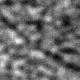
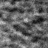

  <h1>Neighbor2Inverse: Self-Supervised Denoising
for Low-Dose ROI Phase Contrast CT</h1>

  

    Johannes B. Thalhammer, Tina Dorosti, Sebastian Peterhansl, Florian Schaff, Daniela Pfeiffer, Franz Pfeiffer, Martin Donnelley, Ronan Smith, Marcus Kitchen, Jannis Ahlers, Lucy Costello, Lorenzo D’Amico, Kaye Morgan
  

  

    <b>Abstract—</b> Propagation-based X-ray phase-contrast imaging (PBI) provides high-contrast visualization of lung structures, but dose reduction is essential to make it as safe as possible. While convolutional neural network–based denoising with supervised training can achieve strong performance, acquiring large paired datasets of low- and high-dose images is often impractical, motivating the development of self-supervised methods.  
    We propose Neighbor2Inverse, a self-supervised denoising approach for low-dose PBI computed tomography. Following the Neighbor2Neighbor principle, noisy projections are subsampled to generate two measurements with nearly identical object structures but independent noise realizations. These are reconstructed, and the resulting image pairs are used to train a denoising network in the reconstruction domain. We evaluate multiple variations of the framework and compare against state-of-the-art methods. Neighbor2Inverse achieves improved noise suppression while preserving structural detail, as confirmed by higher contrast-to-noise ratio, enhanced spatial resolution, and an improved composite quality index.  
    Code and data are publicly available at <a href="https://github.com/J-3TO/Neighbor2Inverse" style="color:#00bfff;">https://github.com/J-3TO/Neighbor2Inverse</a>.
  

  <h3 style="margin-bottom: 8px;">Denoising results of different methods on projections measured with 15 ms exposure time.</h3>
  Interactive version of Figure 2. <b>Drag each slider to reveal the denoised image.</b>

  
200ms

  
Gaussian Filter

  
BM3D

  
ProjFakeNoiseNet

  
Nei2Nei U-Net L2

  
Nei2Nei U-Net L1

  
Nei2Nei KBNet L2

  
Nei2Nei KBNet L1

  

    
  

  <!-- The next 7 cells will be filled by JS -->

  <h3 style="margin-bottom: 8px;">Denoising results of Neighbor2Inverse with different exposure times and projection views.</h3>
  Interactive version of Figure 6. <b>Drag each slider to reveal the denoised image.</b>

  

    
1800 proj.

    
900 proj.

    
600 proj.

    
450 proj.

    
360 proj.

    
300 proj.

    
225 proj.

  

  

    
200ms

    
100ms

    
67ms

    
50ms

    
33ms

    
25ms

    
15ms

  

  

  

