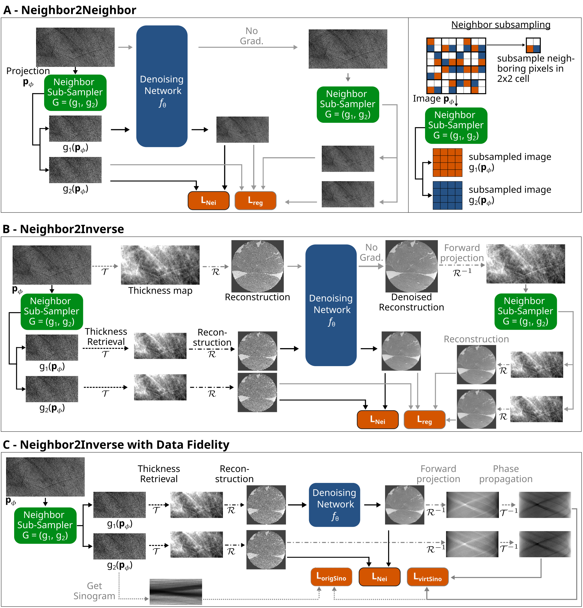

<link rel="stylesheet" href="style.css">

  

    <h1>Neighbor2Inverse: Self-Supervised Denoising for Low-Dose ROI Phase Contrast CT</h1>
    

      Johannes B. Thalhammer, Tina Dorosti, Sebastian Peterhansl, Florian Schaff, Daniela Pfeiffer, Franz Pfeiffer, Martin Donnelley, Ronan Smith, Marcus Kitchen, Jannis Ahlers, Lucy Costello, Lorenzo D’Amico, Kaye Morgan
    

    

      <b>Abstract—</b> Propagation-based X-ray phase-contrast imaging (PBI) enables high-contrast visualization of lung structures and holds strong clinical potential. However, safe translation requires substantial radiation dose reduction, which inevitably increases image noise. Supervised Convolutional Neural Network-based denoising can restore image quality but depends on paired low- and high-dose datasets, which are rarely available in practice. Self-supervised methods avoid this limitation, yet most are not well adapted to the inverse problem of PBI computed tomography (CT).  
      We introduce <i>Neighbor2Inverse</i>, a self-supervised denoising framework for low-dose PBI CT. Building on the Neighbor2Neighbor principle, each noisy projection is subsampled into two variants that preserve structural information but contain independent noise realizations. These are reconstructed separately, and the resulting pairs are used to train a denoising network directly in the reconstruction domain. We systematically investigate multiple framework variants and benchmark against state-of-the-art denoising methods.  
      In region-of-interest PBI CT experiments, <i>Neighbor2Inverse</i> achieves superior noise suppression while maintaining fine structural details, as confirmed by visual assessment, increased contrast-to-noise ratio, enhanced spatial resolution, and improved composite image quality metrics.  
      Code and data are publicly available at <a href="https://github.com/J-3TO/Neighbor2Inverse" style="color:#00bfff;">https://github.com/J-3TO/Neighbor2Inverse</a>.  
      Under submission.
    

  

  

  

    <h3>Overview of the Neighbor2Inverse method</h3>
  

  

    
  

  

  

    <h3 style="margin-bottom: 8px;">Denoising projections (15ms) by various methods.</h3>
    Interactive version of Figure 2. <b>Drag each slider to reveal the denoised image.</b>
  

  

    
200ms

    
Gaussian Filter

    
BM3D

    
ProjFakeNoiseNet

    
Nei2Nei U-Net L2

    
Nei2Nei U-Net L1

    
Nei2Nei KBNet L2

    
Nei2Nei KBNet L1

  

  

    

      
    

    <!-- The next 7 cells will be filled by JS -->
  

  

  

    <h3 style="margin-bottom: 8px;">Denoising reconstructed CT images (15ms) by various methods</h3>
    Interactive version of Figure 3. <b>Drag each slider to reveal the denoised image.</b>
  

  

    
200ms

    
15ms

    
Nei2Nei

    
RecoFakeNoiseNet

    
Noise2Inverse

    
Neighbor2Inverse

  

  

  

  

    <h3 style="margin-bottom: 8px;">Comparison of different Neighbor2Inverse regularization and subsampling strategies</h3>
    Interactive version of Figure 4. <b>Drag each slider to reveal the denoised image.</b>
  

  

    
200ms

    
15ms

    
proj. subsampling  LNei+Lreg

    
proj. subsampling  LNei

    
sino. subsampling  LNei

    
DataFidelityOrigSino  LNei+LorigSino

    
DataFidelityVirtSino  LNei+LvirtSino

  

  

  

  

    <h3 style="margin-bottom: 8px;">Denoising reconstructed CT images (15ms - 900 projs.) by various methods</h3>
    Interactive version of Figure 5. <b>Drag each slider to reveal the denoised image.</b>
  

  

    
15ms -  1.800 projs.

    
15ms -  900 projs.

    
Nei2Nei

    
proj. subsampling  LNei

    
sino. subsampling  LNei

    
DataFidelityOrigSino  LNei+LorigSino

    
DataFidelityVirtSino  LNei+LvirtSino

  

  

  

  

    <h3 style="margin-bottom: 8px;">Denoising results of Neighbor2Inverse with different exposure times and projection views.</h3>
    Interactive version of Figure 6. <b>Drag each slider to reveal the denoised image.</b>
  

  

    

      
1800 proj.

      
900 proj.

      
600 proj.

      
450 proj.

      
360 proj.

      
300 proj.

      
225 proj.

    

    

      
200ms

      
100ms

      
67ms

      
50ms

      
33ms

      
25ms

      
15ms

    

    

      <!-- Cells will be filled by JS -->
    

  

<footer>
  
© 2025 Neighbor2Inverse Project

</footer>

<!-- Reference your main.js file at the end of the body -->
